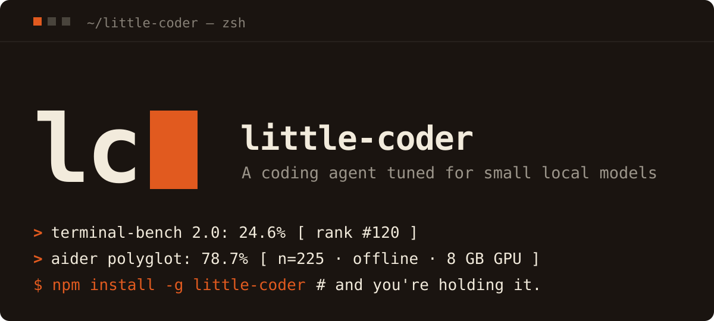

# little-coder

**This is a fork of the original little-coder by itayinbarr introduced in [_Honey, I Shrunk the Coding Agent_](https://open.substack.com/pub/itayinbarr/p/honey-i-shrunk-the-coding-agent)**. If you want to read some background, start there.

## Highlights

- Built on [pi](https://pi.dev) as the minimal core -- supports any pi extensions for customization
- Efficient System Prompt -- standard system prompt [AGENTS.md](./AGENTS.md) clocks in at only ~3000 characters, including dynamic steering. At ~4 characters per token, that's only ~750 tokens!
- Subagent support -- Select the model (`/subagent-model [subagent] [model]` or for all subagents `/subagent-model-all [model]`) and improve your context efficiency
- Dynamic Subagent Steering -- automatically injects a notice for subagent use depending on the selected level `/subagent-level (off|low|medium|high|xhigh)`
- Dynamic Skill Steering -- reads frontmatter entries from skill files, including tools like [bash](./skills/tools/bash.md), to remind the agent how to do things
- Extra-tooling support -- Lots of agents will try to `cd [cwd]` at the start of bash commands. The `bash` tool supports an optional `cwd` parameter that some agents may use for a more structured approach
- Dynamic Tool Loading -- Dynamic Skill Steering automatically loads the skill for a tool, but if the agent wants to know what's available, it can execute `tools` or `skills` to get a list and short descriptions for each loaded tool. No context bloat at start loading in 500 skills and tools that you installed "just in case"
- LSP support -- building on top of [pi-hooks/lsp](https://github.com/prateekmedia/pi-hooks/tree/main/lsp) with some minor updates like C#/.NET support
- Breadcrumbs -- Search through old sessions
- Efficient Browsing Tools -- Browsing Tools are disabled by default (except for webfetch/websearch) to not bloat context and confuse the agent. Can just be enabled by the agent if needed
- Tuned for small models -- Failed tool call steering, Write Guards, CWD Guards, Looser Parameter Enforcement, Heuristical Improvements, etc.
- Efficient Planning & Reviewing -- Two commands, `/deep-plan` and `/review` start subagent-focused pipelines that avoid many pitfalls
- Efficient Context Compression (Experimental) -- Integration of pi-vcc for more efficient context compressions. Needs some tuning I think.
- Bundled extensions -- [Ponytail](./skills/ponytail.md), [pi-powerline-footer](./), [pi-insights](./), [pi-inspect](./), [plannotator](./), [pi-better-openai](./), [pi-ask-user](./), [pi-vcc](./)

Want to read more? The easiest way is to read the source code, but just open an issue with any questions you have. There's also still plenty of experimental features in this repo that aren't mentioned. Any suggestions are welcome :)

## Install

If you've never used pi, it's useful to skim [pi.dev](https://pi.dev) first.

One-line install (Node.js 22.19+ required):

```bash
curl -fsSL https://raw.githubusercontent.com/L3tum/little-coder/main/install.sh | bash
```

Or with npm directly from this fork:

```bash
npm install -g github:L3tum/little-coder
```

Or with [bun](https://bun.sh):

```bash
bun add -g github:L3tum/little-coder
```

That's the whole install. No clone, no `npm install` in a workspace, no PATH fiddling. `little-coder` is now on your PATH and works from any directory.

> **Note for `bun add -g` users.** The launcher (`bin/little-coder.mjs`) is a Node.js script with `#!/usr/bin/env node` at the top, so Node ≥ 22.19 still has to be on your PATH for the binary to start — bun is fine for installing/updating this fork, but the runtime is Node. If you want a fully node-less setup, replace the shebang in `$(bun pm bin -g)/little-coder` with `#!/usr/bin/env bun`.

## Run

```bash
cd ~/your-project
little-coder --model llamacpp/qwen3.6-35b-a3b
```

This is the canonical setup little-coder is tuned for: a local llama.cpp server hosting Qwen3.6-35B-A3B. See **[Local model setup (optional)](#local-model-setup-optional)** below for how to serve it.

Cloud models work the same way:

```bash
little-coder --model anthropic/claude-haiku-4-5
little-coder --model openai/gpt-4o-mini "What does this codebase do?"
little-coder --model ollama/qwen3.5             # local Ollama
little-coder --model lmstudio/local-model       # local LM Studio (whatever model you have loaded)
little-coder --list-models                      # see everything pi knows about
```

The agent uses the directory you launched it from as its working directory — `read` / `write` / `edit` / `bash` operate on your project, not on little-coder's install path.

In the TUI you can use `/tools` to list loaded tools and `/skills` to list available skills. The agent can also call `tools`, `skills`, and `enableBrowserTools` directly.

Use `/plan` to enter browser-reviewed planning mode before implementation.
Use `/deep-plan` for a subagent focused planning pipeline of RESEARCH, COMPOSE, REVIEW.
Use `/review` (changes only), `/review-project` or `/review-focused` for a subagent focused reviewing pipeline including 7 different subagents.

little-coder uses reflection-generated skills and breadcrumbs for reusable session learning. Use `/reflect`, `/reflect-review`, `/breadcrumbs`, `/skills`, and `/promote-user-skill` to draft, review, search, load, and promote reusable guidance. Reflection writes accepted drafts to user-level `~/.pi/skills/<skill>/SKILL.md`; `/promote-user-skill [skill]` copies stable user skills into repo `skills/user/<skill>/` after duplicate checks so they can be packaged.

Use `/usage` for the inline usage dashboard and `/insights` for the vendored Pi Insights report.

For local providers (llama.cpp, Ollama, LM Studio) pi expects _some_ value in the API-key env even though local servers ignore it:

```bash
export LLAMACPP_API_KEY=noop
export OLLAMA_API_KEY=noop
export LMSTUDIO_API_KEY=noop
```

`LLAMACPP_BASE_URL`, `OLLAMA_BASE_URL`, and `LMSTUDIO_BASE_URL` override the defaults (`http://127.0.0.1:8888/v1`, `http://127.0.0.1:11434/v1`, `http://127.0.0.1:1234/v1`).

For cloud providers, set the standard env (`ANTHROPIC_API_KEY`, `OPENAI_API_KEY`, etc.) and pi will discover it.

## Configuring models

The shipped model list lives in **`models.json`** at the package root. The `llama-cpp-provider` extension reads it at startup and registers each provider via pi's `registerProvider()`. Editing this file in your global install **does** take effect — but it's overwritten on the next `npm install -g github:L3tum/little-coder`, so for anything you want to keep, use a user override file instead.

User override resolution (first match wins):

1. `$LITTLE_CODER_MODELS_FILE` — explicit path, useful for ad-hoc tests.
2. `$XDG_CONFIG_HOME/little-coder/models.json`
3. `~/.config/little-coder/models.json`

Merge semantics: each top-level provider key in your override file **fully replaces** the same key in the shipped `models.json`. Providers only in your file are added; providers only in the shipped file are kept. (We don't deep-merge per-model fields — you redeclare the whole provider entry, which avoids "your override silently inherited new fields from a future package release" surprises.)

Example — switch the llama.cpp port and bump `qwen3.6-35b-a3b` to a 150K context, leave ollama untouched:

```json
{
  "providers": {
    "llamacpp": {
      "api": "openai-completions",
      "baseUrl": "http://127.0.0.1:1234/v1",
      "apiKey": "LLAMACPP_API_KEY",
      "models": [
        {
          "id": "qwen3.6-35b-a3b",
          "name": "Qwen3.6-35B-A3B (local llama.cpp, 150K)",
          "reasoning": true,
          "input": ["text"],
          "contextWindow": 150000,
          "maxTokens": 4096,
          "cost": { "input": 0, "output": 0, "cacheRead": 0, "cacheWrite": 0 }
        }
      ]
    }
  }
}
```

Then verify with `little-coder --list-models` — you should see your overridden entry.

`LLAMACPP_BASE_URL`, `OLLAMA_BASE_URL`, and `LMSTUDIO_BASE_URL` env vars still beat both files for those three providers.

`.pi/settings.json` is a separate concern: it controls per-model **profiles** (context_limit, thinking_budget, temperature, max_tokens, benchmark_overrides) referenced by the `<provider>/<id>` key. Profiles don't register or describe models — they only tune how little-coder runs against models that are already registered. A profile's `max_tokens` is applied to the outgoing request (capped by the model's registered context window); `max_tokens: 0` disables the output cap **on local servers** (llama.cpp/ollama/lmstudio — the server clamps to the remaining context). On a remote provider `max_tokens: 0` simply omits the cap (the model catalog default applies — remote APIs reject the unlimited sentinel). Profiles resolve from the package default, your per-user `~/.pi/agent/settings.json`, and the per-repo `.pi/settings.json` (repo wins).

---

## Permissions

little-coder gates `Bash` tool calls against a built-in safe-prefix whitelist (`ls`, `cat`, `head`, `tail`, `git log/status/diff`, `find`, `grep`, `cp`, `mv`, `mkdir`, `touch`, etc.) before pi's own confirmation flow ever sees them. `rm` and `sudo` are intentionally not on the list — add them via `LITTLE_CODER_BASH_ALLOW` per deployment if you really need them.

Two env vars control the gate:

| Env var                        | Values                                       | Effect                                                                                                                                                                                                               |
| ------------------------------ | -------------------------------------------- | -------------------------------------------------------------------------------------------------------------------------------------------------------------------------------------------------------------------- |
| `LITTLE_CODER_PERMISSION_MODE` | `auto` _(default)_ / `accept-all` / `manual` | `auto`: block any bash command not on the whitelist. `accept-all`: skip the gate entirely, every bash call passes (the benchmark runner sets this). `manual`: same as `auto` but with a different rejection message. |
| `LITTLE_CODER_BASH_ALLOW`      | comma-separated prefixes                     | Extra allow-prefixes merged with the built-in list. **Trailing whitespace is meaningful**: `"make "` allows `make test` but not `makefoo`; `"make"` allows both.                                                     |

Examples:

```bash
# Add 'make' (with word-boundary) and 'docker compose ps' on top of the defaults
export LITTLE_CODER_BASH_ALLOW="make ,docker compose ps"

# Skip the gate entirely (use this only inside controlled environments)
export LITTLE_CODER_PERMISSION_MODE=accept-all
```

Write/Edit confirmations are pi's responsibility; little-coder doesn't intercept those.

### Settings-file allowlist

The same allowlist can live in the existing pi settings files, which is usually
better than an env var: it's per-user or per-repo instead of per-shell.

| File                                                                  | Scope    | When it's honored                                                                                                                   |
| --------------------------------------------------------------------- | -------- | ----------------------------------------------------------------------------------------------------------------------------------- |
| `~/.pi/agent/settings.json` (or `$PI_CODING_AGENT_DIR/settings.json`) | per-user | always                                                                                                                              |
| `<repo>/.pi/settings.json`                                            | per-repo | **only after the project is trusted** (pi's project-trust flow) — an untrusted repo's settings file can't widen the shell allowlist |

```json
{
  "little_coder": {
    "bash_allow": ["make ", "docker compose ps "]
  }
}
```

- Same word-boundary convention as the env var: entries are **prefix-matched**,
  and the **trailing space is the word boundary** (`"make "` allows `make test`
  but not `makefoo`; `"docker compose ps"` without the trailing space would
  also match `docker compose psfoo` — add the space).
  **Project-scope** entries (the repo's `.pi/settings.json`) are
  auto-normalized to word-boundary form — `"make"` is stored as `"make "`
  (allows `make …`, not `makefoo`); global-file and env entries keep their
  exact form (your own values, your caveat).
- Merged additively with the built-in list and `LITTLE_CODER_BASH_ALLOW`
  (pure union — settings can only add, never remove built-ins).
- In a repo's `.pi/settings.json`, `bash_allow` accepts the **array form
  only** (object/per-repo maps are a user-file concept; an object there is
  silently ignored).
- Project trust for this gate follows pi's `trust.json`: a **parent
  directory** marked trusted also trusts every repo under it — so a repo
  that lives under a trusted parent inherits that trust, and its own
  `.pi/settings.json` `bash_allow` is honored. **Warning:** trusting a
  parent directory auto-approves shell commands (`bash_allow`) for
  **every** repo under it — the trust decision is stored per agent dir in
  `trust.json`, not per repo.
- **Session-only trust is not honored by this gate.** pi's interactive
  trust prompt offers "trust for this session only"; that session-level
  grant is **not** persisted to `trust.json`, so little-coder's trust gate
  does not see it — per-repo settings (`bash_allow`, model profiles, the
  `token_limit_auto_continue` opt-out) stay off until the project is
  persistedly trusted (`/trust`) or a new session starts.
- The settings-file allowlist is **cached for the session** (keyed on the
  canonical repo path); a mid-session edit to a settings file applies after
  the next `/allow`/`/deny`/`--reload` or the next session, not the next
  turn. (This is
  deliberate — it keeps the one-time notices stable — while other
  `little_coder.*` settings are re-read on every use.) Trust revocation is
  **one-way** mid-session: un-trusting a project immediately drops its
  project-scoped prefixes (re-checked per call), but re-trusting does **not
  restore** them until the next `session_start`/`/allow`/`/deny`/`--reload`.
- When a per-repo file contributes prefixes, the session shows a one-time
  notification (`bash allowlist: N project-scoped prefix(es) active from
.pi/settings.json: "make ", "docker compose ps ", …`) naming the active
  prefixes (first six, then a count) so the repo's auto-approval is
  visible, not silent. Same for the `/allow`-based repo-scoped notice.
- Malformed entries (non-strings, empty) are ignored without failing startup.

### Per-repo allowlists: `/allow` and `/deny`

`/allow <command>` and `/deny <command>` manage an allowlist **for the current
repo only**, so you can approve `make test` in one project without widening
the list everywhere. By default they write to your **user** settings file
(`~/.pi/agent/settings.json`) — never into the repo's own `.pi/settings.json`,
which is deliberate: a repo must not be able to auto-approve its own shell
commands (that's exactly what the trust gate prevents), and nothing gets
committed into your working tree.

`bash_allow` in the user file accepts two equivalent shapes:

```json
{
  "little_coder": {
    "bash_allow": {
      // per-repo map (what /allow writes)
      "global": ["make "], // reserved key = applies everywhere
      "/home/tom/workspace/little-coder": ["docker compose ps "]
    }
  }
}
```

The plain-array form above stays fully supported (purely global). When `/allow`
runs against an array-form file, it converts it to the map form, preserving
existing entries under the reserved `"global"` key. Once a repo's list is
emptied again the value collapses back to an array.

- Repo key = the directory you launch little-coder from (canonicalized with
  `realpath`, the same convention as `trust.json`). Because the key is the
  canonical launch path, **moving a repo (or adding a new symlink alias)
  orphans its `/allow` entry** in your global settings — re-run `/allow`
  from the new path.
- Input is normalized to a word-boundary prefix: `/allow make test` stores
  `"make test "` (allows `make test …`, not `make build`); a single pair of
  surrounding quotes is stripped (`/allow "make test"` stores `"make test "`).
- Changes apply **immediately** in the running session and persist across
  launches; a one-time notice names the active repo-scoped prefixes (first
  six, then a count).
- `/deny` only removes settings-file entries. If the command is still allowed
  via the built-in safe prefixes, `LITTLE_CODER_BASH_ALLOW`, or your global
  list, the reply says exactly which source keeps it allowed — built-ins can
  never be removed (use a different `LITTLE_CODER_PERMISSION_MODE` or remove
  the global entry instead).
- The writer is fail-safe: a malformed `settings.json` is never clobbered;
  the command reports the error and leaves the file untouched.

---

## Historical paper / benchmark results (source project)

Fork benchmark reruns under L3tum: **TBD**. Table below preserves source-project results for attribution and context.

| Release                                                                                                                   | Model                                                                                   | Benchmark                                      | Result                                                                                                                                                                                                           |
| ------------------------------------------------------------------------------------------------------------------------- | --------------------------------------------------------------------------------------- | ---------------------------------------------- | ---------------------------------------------------------------------------------------------------------------------------------------------------------------------------------------------------------------- |
| [**v0.0.2**](https://github.com/itayinbarr/little-coder/releases/tag/v0.0.2) (commit `1d62bde`) — the paper               | Qwen3.5-9B via Ollama                                                                   | Aider Polyglot (225 exercises)                 | **45.56 %** mean of two runs; matched-model vanilla Aider baseline 19.11 %. Paper: [_Honey, I Shrunk the Coding Agent_ on Substack](https://open.substack.com/pub/itayinbarr/p/honey-i-shrunk-the-coding-agent). |
| [**v0.0.5**](https://github.com/itayinbarr/little-coder/releases/tag/v0.0.5) — pre-pi Python                              | Qwen3.6-35B-A3B via llama.cpp                                                           | Aider Polyglot                                 | **78.67 %**. [Full narrative](docs/benchmark-qwen3.6-35b-a3b.md).                                                                                                                                                |
| [**v0.1.4**](https://github.com/itayinbarr/little-coder/releases/tag/v0.1.4) — on pi                                      | Qwen3.6-35B-A3B via llama.cpp                                                           | Terminal-Bench-Core v0.1.1 (80 tasks)          | **40.0 %** in 6 h 50 min. [Write-up](docs/benchmark-terminal-bench-v0.1.1.md).                                                                                                                                   |
| [**v0.1.13**](https://github.com/itayinbarr/little-coder/releases/tag/v0.1.13) — on pi, TB 2.0 leaderboard                | Qwen3.6-35B-A3B via llama.cpp                                                           | Terminal-Bench 2.0 (89 tasks × 5 trials = 445) | **24.6 % ± 3.2** — accepted to the [Terminal-Bench 2.0 leaderboard](https://www.tbench.ai/leaderboard/terminal-bench/2.0) (rank 120).                                                                            |
| [**v0.1.24**](https://github.com/itayinbarr/little-coder/releases/tag/v0.1.24) — on pi, TB 2.0 leaderboard, smaller model | Qwen3.5-9B (Q4_K_M) via llama.cpp (5.3 GB on GPU, 2× faster per-token than the 35B-A3B) | Terminal-Bench 2.0 (89 tasks × 5 trials = 445) | **9.2 % ± 2.4** — accepted to the [Terminal-Bench 2.0 leaderboard](https://www.tbench.ai/leaderboard/terminal-bench/2.0) (rank 142).                                                                             |
| [**v0.1.27**](https://github.com/itayinbarr/little-coder/releases/tag/v0.1.27) — on pi, GAIA validation                   | Qwen3.6-35B-A3B via llama.cpp                                                           | GAIA validation set (165 tasks)                | **40.00 %** (66 / 165). L1 60.4 % / L2 37.2 % / L3 7.7 %. Test-split run pending.                                                                                                                                |

All runs used a consumer laptop: i9-14900HX, 32 GB RAM, **8 GB VRAM** on RTX 5070 Laptop (Blackwell). No cloud inference at any point.

---

## Troubleshooting

**`little-coder: command not found`** — npm's global bin directory isn't on your PATH. Run `npm config get prefix` to see where it installed; add `<prefix>/bin` to your PATH. Or reinstall with `sudo` if your prefix needs root.

**`ECONNREFUSED 127.0.0.1:8888`** — llama.cpp isn't running. Start `llama-server` first, or switch `--model` to an Ollama/cloud ID.

**LAN client times out (no `RST`, just hangs)** — the inference box's firewall is dropping the SYN. The usual cause is `ufw` with a default-deny policy that allow-lists only SSH / a few dev ports. From the server: `sudo ufw status verbose` to confirm; `sudo ufw allow from <your-lan-subnet>/24 to any port 8888 proto tcp` to fix (scoped to the LAN so you're not exposing the box). Docker-published ports bypass `ufw` via `PREROUTING` NAT, which is why a Docker container can be reachable while a plain `llama-server` on the same host isn't.

**Image attachment is accepted but the request returns 4xx** — your llama-server is running without a vision projector. Re-launch it with `--mmproj ~/models/mmproj-F16.gguf` (or another mmproj variant from the same GGUF repo). The `--list-models` `images` column reflects what the client _will attempt to send_, not what the server can answer; the projector is what gives the model eyes.

**No API key env var warning** — pi expects _some_ key even for local providers. Export `LLAMACPP_API_KEY=noop` (or `OLLAMA_API_KEY=noop`) before launching.

**No pi "Update Available" banner** — that's intentional. little-coder defaults `PI_SKIP_VERSION_CHECK=1` so the bundled pi runtime doesn't nag about updating itself; little-coder pins pi to a known-good version per release. If you actually want the banner back, `export PI_SKIP_VERSION_CHECK=0` before launching.

**Extension load failures on startup** — run `little-coder --list-models --verbose`; extension errors surface there. If the install looks corrupt: `npm uninstall -g little-coder && npm install -g github:L3tum/little-coder`.

**Launch feels slow / measure it** — `LITTLE_CODER_TIMING=1 little-coder` prints launcher phase timings, the child preload cost, and pi's own per-extension startup timings on stderr. The update check never blocks startup on the network anymore (cache-only + background refresh: the "update available" notice reflects the last successful online refresh — offline launches can see an arbitrarily stale `latest`); the llama.cpp context probe is disk-cached (refreshed by a background re-probe on each launch; a warm launch uses the cached value immediately) and defaults to a 500 ms timeout. See [docs/startup-performance.md](docs/startup-performance.md) for the full breakdown and profiling recipe.

**Output cut off repeatedly on a local server** — the token-limit auto-continue loop nudges the model to resume (up to 3 times, then a conciseness correction, then it backs off at 5; with compaction enabled (default) recovery is compaction, without it the turn aborts). Disable it with `little_coder.token_limit_auto_continue: false` in your settings file or `LITTLE_CODER_TOKEN_LIMIT_AUTO_CONTINUE=0` — the off-switch then intervenes (and aborts when compaction is disabled) on **every** token-limit turn. The per-repo `token_limit_auto_continue` is honored **only for trusted projects** (like `bash_allow`); an untrusted repo cannot disable the safety net, so its per-user (global) value applies.

**Node version too old** — little-coder needs Node ≥ 22.19.0 (matching the minimum of the bundled `@earendil-works/pi-coding-agent` v0.75+). Check with `node --version`. Easiest fix: `nvm install 22 && nvm use 22`.

---

## Developing little-coder locally

If you want to hack on the extensions or skills:

```bash
git clone https://github.com/L3tum/little-coder.git
cd little-coder
npm install
npm link            # makes the local checkout available as `little-coder`
little-coder --model llamacpp/qwen3.6-35b-a3b
```

To unlink: `npm unlink -g little-coder`.

The benchmarks harness (`benchmarks/`) is dev-only and not shipped with the npm package. Run it from a clone with `python3 benchmarks/aider_polyglot.py …` etc.

---

**Key invariant.** pi is a minimal base by design. Every little-coder mechanism ships as a pi extension that hooks pi's lifecycle events (`before_agent_start`, `context`, `before_provider_request`, `tool_call`, `tool_result`, `turn_end`, `session_compact`). Extensions are independent: the launcher discovers every `.pi/extensions/*/index.ts` and loads it explicitly with `--extension`, and pi runs with `--no-extensions`, so the bundled set is exactly what loads — no more, no less. If you don't want one, delete its directory; if you want to add another, drop it next to the existing ones (or pass `-e <path>` at launch).

---

## Attribution

This fork is maintained by **L3tum**.

Source project: [Itay Inbar's little-coder](https://github.com/itayinbarr/little-coder), Apache 2.0. Historical paper claims, benchmark figures, and release links in this README refer to that source project unless noted otherwise.

little-coder v0.0.x was a derivative work of [CheetahClaws / ClawSpring](https://github.com/SafeRL-Lab/clawspring) by SafeRL-Lab, Apache 2.0. That upstream provided the Python agent substrate, tool system, multi-provider support, and REPL.

little-coder v0.1.0+ replaces that substrate with **[pi](https://pi.dev)** by Mario Zechner — Apache 2.0 / MIT. The npm package was renamed from `@mariozechner/pi-coding-agent` to `@earendil-works/pi-coding-agent` in upstream's 0.74 release; little-coder v1.4.2+ ships with the new package. pi provides the agent loop, provider abstraction, TUI, and extension model. little-coder rebuilds its small-model adaptations on top of pi as extensions.

All little-coder-specific mechanisms — Write-vs-Edit invariant, skill / knowledge injection, thinking-budget cap, output-parser, quality-monitor, per-model profiles, per-benchmark overrides, Browser / Evidence tool families, evidence-aware compaction — are preserved across versions.

---

## Dependency policy

little-coder's dependencies are hand-picked for the pi runtime: they must load
under pi's ESM extension system, stay out of the launch critical path, and
not bloat the `node_modules` that ships inside the npm package. **Do not add a
dependency without verifying it loads under pi's ESM extension system** and
measuring its startup cost — see [docs/startup-performance.md](docs/startup-performance.md)
for the budget and the profiling recipe.

---

## License

Apache 2.0 — see [LICENSE](LICENSE) for details. NOTICE tracks upstream attribution.
